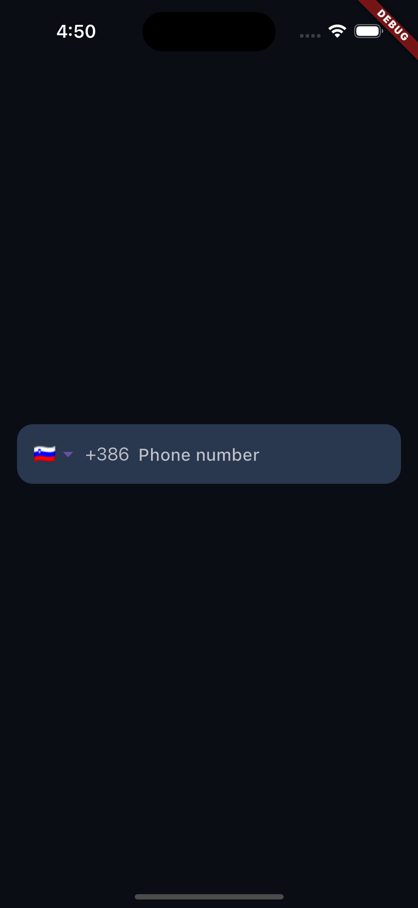
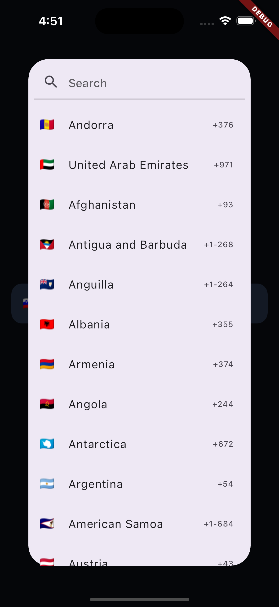
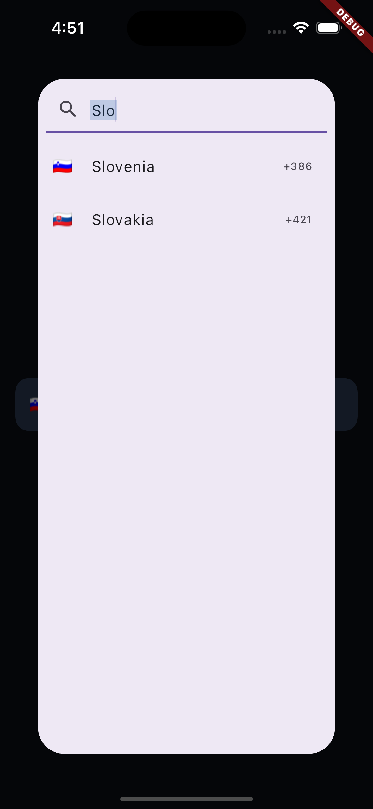

# Mobile Number Input

`mobile_number_input` is a Flutter package designed to streamline the process of taking a mobile number input from users. It features an intuitive country code picker and ensures consistent phone number formats.

## Features

- **Country Code Picker**: Users can easily select their country code from a dropdown list.
- **Customizable UI**: Style the input field and picker to match your app's design.
- **Input Validation**: Ensures that users enter a valid phone number format.

## Usage

Here's a quick example to get you started:

```dart
import 'package:flutter/material.dart';
import 'package:mobile_number_input/mobile_number_input.dart';

class MyHomePage extends StatefulWidget {
  @override
  _MyHomePageState createState() => _MyHomePageState();
}

class _MyHomePageState extends State<MyHomePage> {
  final TextEditingController _numberController = TextEditingController();
  CountryCode _selectedCountry = CountryProvider.findCountryByName('Slovenia');

  @override
  void dispose() {
    super.dispose();
    _numberController.dispose();
  }

  void _onCountryChanged(CountryCode countryCode) {
    if (mounted) {
      setState(() {
        _selectedCountry = countryCode;
      });
    }
  }

  @override
  Widget build(BuildContext context) {
    return Scaffold(
      background: Colors.black,
      body: Center(
        child: Padding(
          padding: const EdgeInsets.all(16.0),
          child: MobileNumberInput(
            onCountryChanged: _onCountryChanged,
            defaultCountry: _selectedCountry,
            controller: _numberController,
            hintText: 'Phone number',
            hintStyle: const TextStyle(color: Color(0xFFBEC0C7)),
            textStyle: const TextStyle(color: Colors.white),
            dialCodeTextStyle: const TextStyle(color: Color(0xFFBEC0C7)),
            decoration: BoxDecoration(
              color: const Color(0xFF29374F),
              borderRadius: BorderRadius.circular(15),
            ),
            border: OutlineInputBorder(
              borderRadius: BorderRadius.circular(15),
            ),
            enabledBorder: OutlineInputBorder(
              borderRadius: BorderRadius.circular(15),
              borderSide: const BorderSide(color: Color(0xFF29374F)),
            ),
            focusedBorder: OutlineInputBorder(
              borderRadius: BorderRadius.circular(15),
              borderSide: const BorderSide(color: Colors.blue),
            ),
          ),
        ),
      )
    );
  }
}
```

### EXAMPLE IMAGES


  <!-- Row 1 -->
  
  
  <br>
  
  <!-- Row 2 -->
  
  


